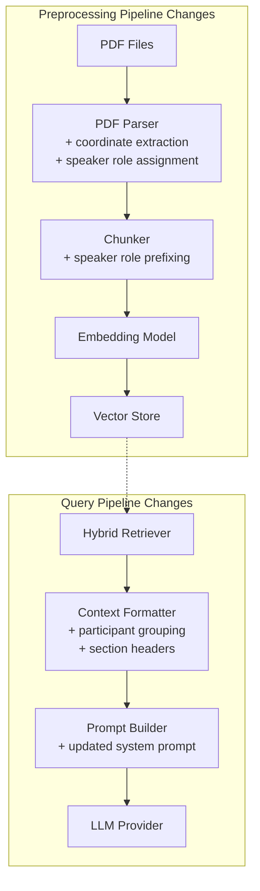
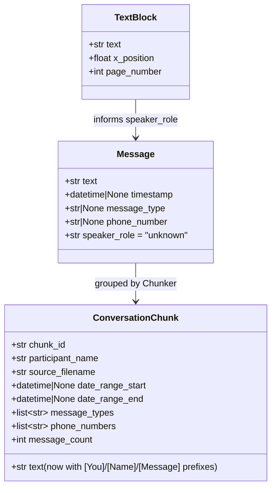

# Design Document: Participant Context Clarity

## Overview

This design improves how the RAG system presents conversation context to the LLM to prevent participant confusion. The current implementation passes retrieved passages in a flat list ordered by relevance score, with only a brief parenthetical source reference. The LLM (llama3.1:8b) frequently conflates messages from separate conversations as if participants were talking to each other.

Two complementary approaches address this:

1. **Participant-Grouped Context Formatting** — The `Context_Formatter` groups retrieved passages by participant name, wraps each group in a structural header, and orders them by relevance. This gives the LLM explicit signals about conversation boundaries.

2. **Speaker Role Tagging** — The `PDF_Parser` investigates two methods for determining who sent vs. received each message: x-coordinate analysis of text blocks (left/right alignment in chat bubble layouts), and a delivery receipt heuristic using the "Παραδόθηκε" pattern. The `Chunker` then prefixes each message line with `[You]:`, `[{Name}]:`, or `[Message]:` to disambiguate direction.

### Design Decisions

| Decision | Choice | Rationale |
|----------|--------|-----------|
| Coordinate detection as primary | x-coordinate threshold | Chat PDFs typically render sent messages right-aligned; coordinate extraction is more reliable when it works |
| Delivery receipt as fallback | "Παραδόθηκε" pattern | Already detected in the parser as a boundary marker; reusing it for speaker tagging is low-cost |
| 80% reliability threshold | Configurable | Prevents assigning roles when the PDF layout doesn't follow the left/right pattern |
| Prefix format `[You]:` / `[Name]:` | Square brackets + colon | Distinctive pattern unlikely to appear in message text; easy for the LLM to parse |
| Backward compatibility | Old chunks pass through verbatim | Avoids mandatory re-indexing; system works with mixed old/new data |
| Participant section ordering | By max retrieval score descending | Most relevant conversations appear first in the context window |

## Architecture



### Data Flow Changes

1. **Parsing**: `PDF page → text blocks with x-coordinates → speaker role classification → Message objects with speaker_role field`
2. **Chunking**: `Messages with speaker_role → prefixed text lines → ConversationChunk with role-annotated text`
3. **Formatting**: `SearchResults → group by participant_name → sort sections by max score → sort passages by date → emit structured context`
4. **Prompting**: `Grouped context + updated system prompt → LLM understands separate conversations`

## Components and Interfaces

### 1. Extended Message Dataclass (`sms_rag/shared/models.py`)

```python
@dataclass
class Message:
    """A single message extracted from a conversation PDF."""
    text: str
    timestamp: datetime | None = None
    message_type: str | None = None  # "SMS", "iMessage", "RCS", or None
    phone_number: str | None = None
    speaker_role: str = "unknown"  # "sent", "received", or "unknown"
```

The `speaker_role` field defaults to `"unknown"` when detection fails. Allowed values are strictly `"sent"`, `"received"`, or `"unknown"`.

### 2. PDF Parser Coordinate Extraction (`sms_rag/preprocessing/pdf_parser.py`)

New method for extracting text blocks with x-coordinates:

```python
@dataclass
class TextBlock:
    """A text block extracted from a PDF page with spatial information."""
    text: str
    x_position: float  # X-coordinate in points from left edge
    page_number: int

class PDFParser:
    def __init__(self, x_threshold_ratio: float = 0.5, ambiguity_margin: float = 10.0):
        """
        Args:
            x_threshold_ratio: Ratio of page width to use as left/right threshold.
                Default 0.5 (50% of page width).
            ambiguity_margin: Points within which a block is considered ambiguous.
                Default 10.0 points.
        """
        self._x_threshold_ratio = x_threshold_ratio
        self._ambiguity_margin = ambiguity_margin

    def _extract_text_blocks_with_coords(self, page: pymupdf.Page) -> list[TextBlock]:
        """Extract text blocks with x-coordinate positions from a page."""
        ...

    def _classify_speaker_by_coordinates(
        self, text_blocks: list[TextBlock], page_width: float
    ) -> dict[str, str] | None:
        """Classify text blocks as left/right aligned.
        
        Returns a mapping of text -> speaker_role, or None if classification
        is unreliable (<80% of non-ambiguous blocks classifiable).
        """
        ...

    def _assign_speaker_roles_by_receipt(
        self, messages: list[Message]
    ) -> list[Message]:
        """Fallback: assign speaker roles using delivery receipt heuristic."""
        ...
```

**Classification logic:**
1. Calculate threshold: `page_width * x_threshold_ratio`
2. For each text block, compute distance from threshold
3. Blocks within `ambiguity_margin` points of threshold are marked ambiguous
4. Non-ambiguous blocks: `x < threshold` → left-aligned, `x >= threshold` → right-aligned
5. If ≥80% of non-ambiguous blocks are classifiable → use coordinate-based roles
6. Otherwise → log warning, fall back to delivery receipt heuristic

**Priority resolution:**
- Coordinate-based classification takes precedence over delivery receipt heuristic
- If coordinate detection is reliable for the PDF, it is used for all messages
- Delivery receipt heuristic only applies when coordinate detection fails

### 3. Updated Chunker (`sms_rag/preprocessing/chunker.py`)

The chunker gains awareness of `speaker_role` and the participant name:

```python
class ConversationChunker:
    def _build_chunk(
        self,
        messages: list[Message],
        chunk_id: str,
        participant_name: str,
        source_filename: str,
    ) -> ConversationChunk:
        """Build chunk with speaker-role-prefixed text."""
        text = "\n".join(
            self._format_message_line(msg, participant_name) for msg in messages
        )
        # ... rest of metadata aggregation unchanged
    
    @staticmethod
    def _format_message_line(message: Message, participant_name: str) -> str:
        """Format a single message with speaker role prefix.
        
        Returns:
            "[You]: {text}" for sent messages
            "[{participant_name}]: {text}" for received messages
            "[Message]: {text}" for unknown messages
        """
        if message.speaker_role == "sent":
            return f"[You]: {message.text}"
        elif message.speaker_role == "received":
            return f"[{participant_name}]: {message.text}"
        else:
            return f"[Message]: {message.text}"
```

**Round-trip property**: The chunk text can be split back into original messages by splitting on the regex pattern `\n(?=\[(?:You|Message|[^\]]+)\]: )` — each match recovers the original `message.text` after stripping the prefix.

### 4. Context Formatter (`sms_rag/query/orchestrator.py`)

The `_format_context` method is replaced with participant-grouped formatting:

```python
class RAGOrchestrator:
    def _format_context(self, chunks: list[SearchResult]) -> str:
        """Format search results grouped by participant with structural headers."""
        if not chunks:
            return "No relevant conversation passages found."

        # Group passages by participant_name
        groups: dict[str, list[SearchResult]] = {}
        for chunk in chunks:
            participant = chunk.metadata.get("participant_name", "Unknown")
            groups.setdefault(participant, []).append(chunk)

        # Order participant sections by highest score descending
        sorted_participants = sorted(
            groups.keys(),
            key=lambda p: max(c.score for c in groups[p]),
            reverse=True,
        )

        sections = []
        for participant in sorted_participants:
            section_chunks = groups[participant]
            
            # Sort passages within section: dated first (ascending), then undated
            dated = [c for c in section_chunks if c.metadata.get("date_range_start")]
            undated = [c for c in section_chunks if not c.metadata.get("date_range_start")]
            dated.sort(key=lambda c: c.metadata["date_range_start"])
            ordered_chunks = dated + undated

            # Build section
            header = f"## Conversation with {participant} (Your private conversation)"
            passages = []
            for chunk in ordered_chunks:
                date_label = self._format_date_label(chunk)
                passage_text = f"{date_label}\n{chunk.text}" if date_label else chunk.text
                passages.append(passage_text)

            section_body = "\n\n".join(passages)
            sections.append(f"{header}\n\n{section_body}")

        return "\n\n---\n\n".join(sections)

    @staticmethod
    def _format_date_label(chunk: SearchResult) -> str | None:
        """Format date range label for a passage, or None if no dates."""
        start = chunk.metadata.get("date_range_start")
        end = chunk.metadata.get("date_range_end")
        if start and end:
            return f"[{start} to {end}]"
        return None
```

### 5. Updated System Prompt (`sms_rag/query/orchestrator.py`)

```python
_SYSTEM_TEMPLATE = (
    "You are a helpful assistant that answers questions about SMS and WhatsApp "
    "conversations. "
    "Each '## Conversation with ...' section represents a separate, private "
    "conversation between the user and the named participant. "
    "Participants did NOT converse with each other — all messages in a section "
    "are exclusively between the user and that specific participant. "
    "Lines prefixed with [You]: are messages sent by the user. "
    "Lines prefixed with a name (e.g., [Kyriaki]: ) are messages received from "
    "that participant. "
    "Lines prefixed with [Message]: have unknown direction. "
    "Use ONLY the provided conversation passages to answer the user's question. "
    "If the answer cannot be found in the passages, say so clearly. "
    "When referencing information, mention the participant name and approximate date "
    "if available."
)
```

The system prompt always includes the prefix explanation regardless of whether current context uses them. This is simpler and handles mixed old/new data gracefully.

## Data Models

### Extended Message Model



### Formatted Context Structure

```
## Conversation with Kyriaki Salavanitou (Your private conversation)

[2024-02-20 to 2024-02-20]
[You]: Θα σε πάρω αργότερα
[Kyriaki Salavanitou]: Εντάξει, περιμένω

[2024-03-15 to 2024-03-16]
[You]: Τι ώρα θέλεις;
[Kyriaki Salavanitou]: Στις 7

---

## Conversation with Loizos Markides (Your private conversation)

[2024-01-10 to 2024-01-10]
[You]: Are you free tomorrow?
[Loizos Markides]: Yeah, what time?
```

## Correctness Properties

*A property is a characteristic or behavior that should hold true across all valid executions of a system — essentially, a formal statement about what the system should do. Properties serve as the bridge between human-readable specifications and machine-verifiable correctness guarantees.*

### Property 1: Participant Grouping Completeness

*For any* list of SearchResult objects with varying `participant_name` metadata values, the Context_Formatter SHALL produce output where every input passage appears exactly once, grouped under the header for its participant name, with no passages discarded or duplicated.

**Validates: Requirements 1.1, 1.6**

### Property 2: Participant Section Header Format

*For any* participant name string, the Context_Formatter SHALL produce a section header matching exactly the pattern `## Conversation with {name} (Your private conversation)`.

**Validates: Requirements 1.2**

### Property 3: Section Separation

*For any* set of SearchResults containing passages from two or more distinct participants, the formatted output SHALL contain a `---` separator between each pair of adjacent participant sections, and SHALL NOT contain a separator before the first section or after the last section.

**Validates: Requirements 1.3**

### Property 4: Chronological Ordering Within Participant Sections

*For any* set of SearchResults belonging to the same participant with varying `date_range_start` metadata values, the formatted output SHALL present dated passages in ascending chronological order, with undated passages placed after all dated passages.

**Validates: Requirements 1.4, 1.7**

### Property 5: Participant Section Ordering by Score

*For any* set of SearchResults from multiple participants with varying scores, participant sections in the formatted output SHALL be ordered such that the section whose passages have the highest max score appears first, and each subsequent section has a max score less than or equal to the preceding section.

**Validates: Requirements 1.8**

### Property 6: Date Range Annotation Format

*For any* SearchResult with both `date_range_start` and `date_range_end` metadata present, the formatted passage SHALL include an annotation in the format `[YYYY-MM-DD to YYYY-MM-DD]`, and passages without `date_range_start` SHALL have no date annotation.

**Validates: Requirements 1.5**

### Property 7: Coordinate Classification Correctness

*For any* set of text blocks with x-coordinates and a given page width, blocks with `x_position < threshold` (where threshold = page_width × x_threshold_ratio) and not within the ambiguity margin SHALL be classified as left-aligned ("received"), and blocks with `x_position >= threshold` and not within the ambiguity margin SHALL be classified as right-aligned ("sent").

**Validates: Requirements 2.2, 2.4**

### Property 8: Ambiguity Exclusion

*For any* text block whose x-coordinate is within `ambiguity_margin` points of the threshold, that block SHALL be excluded from the reliability percentage calculation and SHALL NOT receive a coordinate-based speaker role assignment.

**Validates: Requirements 2.5**

### Property 9: Coordinate Reliability Threshold

*For any* set of text blocks from a PDF where fewer than 80% of non-ambiguous blocks are classifiable into left/right groups, the coordinate-based classification SHALL be rejected and the system SHALL fall back to the delivery receipt heuristic.

**Validates: Requirements 2.3**

### Property 10: Delivery Receipt Tagging

*For any* sequence of messages where message M is immediately followed by a delivery receipt line in document order, M SHALL be assigned speaker_role "sent". Messages not immediately followed by a receipt (and without coordinate classification) SHALL be assigned "unknown".

**Validates: Requirements 3.1, 3.2**

### Property 11: Speaker Role Assignment Safety Invariant

*For any* set of parsed messages, every message with speaker_role "sent" SHALL be justified by either (a) a delivery receipt immediately following it in document order, or (b) coordinate-based classification indicating right-aligned. No other mechanism SHALL produce a "sent" assignment.

**Validates: Requirements 3.3**

### Property 12: Coordinate Precedence Over Heuristic

*For any* message where both coordinate-based classification and delivery receipt heuristic produce a speaker_role, the final speaker_role SHALL equal the coordinate-based result.

**Validates: Requirements 3.4**

### Property 13: Speaker Role Domain Invariant

*For any* Message object produced by the PDF_Parser, the speaker_role field SHALL contain exactly one of the values "sent", "received", or "unknown".

**Validates: Requirements 3.6, 4.1, 4.2**

### Property 14: Speaker Role Prefix Round-Trip

*For any* list of Message objects with known speaker_roles and a participant name, chunking the messages into a ConversationChunk and then splitting the chunk text on the pattern `\n(?=\[(?:You|Message|[^\]]+)\]: )` SHALL recover the original message texts exactly (after stripping the prefix from each segment).

**Validates: Requirements 5.4, 5.5, 5.6**

### Property 15: Speaker Role Prefix Correctness

*For any* Message with speaker_role "sent", the corresponding line in the chunk text SHALL begin with `[You]: `. For "received" with participant name P, the line SHALL begin with `[{P}]: `. For "unknown", the line SHALL begin with `[Message]: `.

**Validates: Requirements 4.3, 4.4, 5.1, 5.2, 5.3**

### Property 16: Backward-Compatible Chunk Presentation

*For any* SearchResult whose text field does not contain any speaker role prefix patterns, the Context_Formatter SHALL include that text verbatim in the output without injecting or stripping prefix characters.

**Validates: Requirements 6.1**

### Property 17: Full-Unknown Graceful Degradation

*For any* ParsedConversation where all messages have speaker_role "unknown", the Chunker SHALL produce valid ConversationChunk objects where every message line is prefixed with `[Message]:`, and each chunk has non-empty `text`, non-empty `participant_name`, and `message_count > 0`.

**Validates: Requirements 6.3, 6.4**

### Property 18: Conditional Speaker Prefix Prompt Instruction

*For any* formatted context string that contains at least one line matching a speaker role prefix pattern (`[You]:` or `[{Name}]:`), the system prompt SHALL include an explanation of what the prefixes mean.

**Validates: Requirements 7.3**

## Error Handling

### Coordinate Extraction Errors

| Error Condition | Handling | User Impact |
|----------------|----------|-------------|
| PyMuPDF fails to extract block coordinates | Log warning, fall back to receipt heuristic | Messages get "unknown" or receipt-based roles |
| Page has no text blocks | Skip page, continue with remaining pages | No messages extracted from that page |
| All blocks are ambiguous (within margin) | 0% classifiable → fall back to receipt heuristic | Same as unreliable classification |
| PDF has inconsistent layout across pages | Per-PDF reliability check; if <80% overall → fallback | Entire PDF uses receipt heuristic |

### Speaker Role Assignment Errors

| Error Condition | Handling | User Impact |
|----------------|----------|-------------|
| Orphan delivery receipt (no preceding message) | Ignore the receipt line | No effect on output |
| Both methods fail entirely | All messages get "unknown" → `[Message]:` prefix | LLM sees neutral prefixes, no direction info |
| Message text contains prefix-like patterns | Round-trip property still holds (split on `\n` + prefix pattern) | Correctly parsed since split uses line-start anchoring |

### Context Formatting Errors

| Error Condition | Handling | User Impact |
|----------------|----------|-------------|
| SearchResult has no participant_name metadata | Group under "Unknown" participant | LLM still sees structured sections |
| SearchResult has no date metadata | Passage placed after dated passages, no date label | Passage still included |
| Empty SearchResult list | Return "No relevant conversation passages found." | User sees clear "no results" message |
| Mixed old/new format chunks in same result set | Old chunks displayed verbatim in their section; new chunks with prefixes | Both are valid and readable by the LLM |

## Testing Strategy

### Property-Based Testing

**Library**: [Hypothesis](https://hypothesis.readthedocs.io/) (Python)

Property-based tests validate the 18 correctness properties defined above. Each property test:
- Runs a minimum of **100 iterations** with randomly generated inputs
- Is tagged with a comment referencing the design property
- Tag format: `# Feature: participant-context-clarity, Property {N}: {property_text}`

**Key generators to implement:**

- `search_result_generator(participant_names, with_dates, score_range)`: Random SearchResult objects with configurable participant names, date metadata, and scores
- `message_with_role_generator(roles, text_strategy)`: Random Message objects with specified speaker_role values and arbitrary text content (including edge cases like embedded newlines, unicode)
- `text_block_generator(page_width, threshold_ratio, ambiguity_margin)`: Random TextBlock objects with x-coordinates distributed to test classification boundaries
- `parsed_conversation_generator(speaker_roles)`: Random ParsedConversation with messages having specified speaker role distributions

**Property groupings by component:**

| Component | Properties | Focus |
|-----------|------------|-------|
| Context Formatter | 1, 2, 3, 4, 5, 6, 16 | Grouping, ordering, formatting |
| Coordinate Classifier | 7, 8, 9 | Threshold logic, ambiguity handling |
| Speaker Role Assignment | 10, 11, 12, 13 | Receipt heuristic, precedence, invariants |
| Chunker Prefixing | 14, 15, 17 | Round-trip, prefix correctness, degradation |
| System Prompt | 18 | Conditional instruction |

### Unit Tests (Example-Based)

- Message dataclass defaults (`speaker_role` defaults to "unknown")
- Specific PDF text patterns producing expected speaker roles
- System prompt content verification (exact strings)
- Edge case: orphan delivery receipt handling
- Edge case: participant name containing special characters in prefix

### Integration Tests

- Full pipeline: PDF → parse → chunk → embed → retrieve → format → LLM response (with mocked LLM)
- Mixed old/new index: query against index with both prefix-annotated and plain chunks
- Real PDF coordinate extraction: verify PyMuPDF returns usable x-coordinates from known test PDFs
