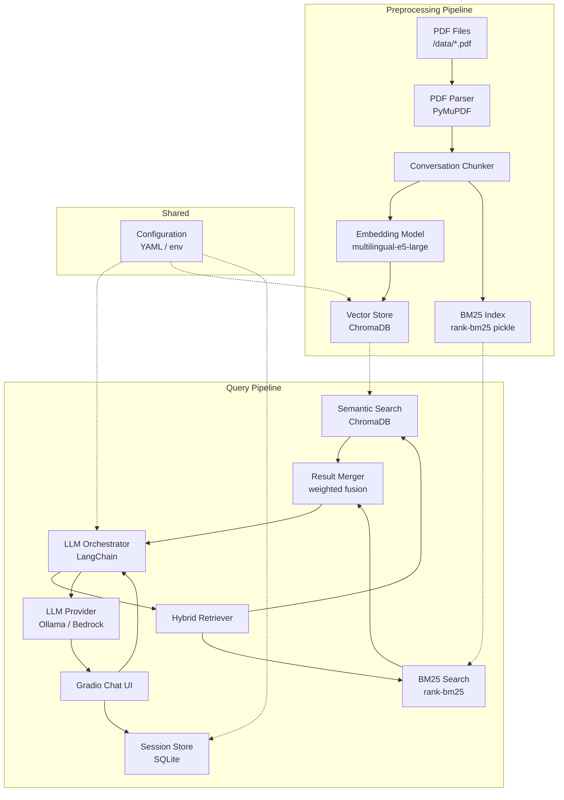
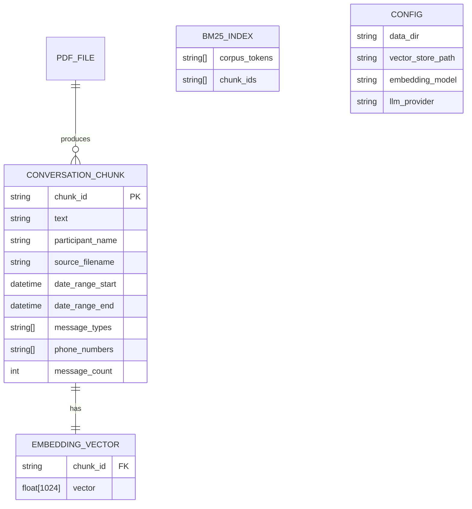

# Design Document: SMS RAG

## Overview

This design describes a Retrieval-Augmented Generation (RAG) system for querying SMS/WhatsApp conversation data stored as PDF files. The system comprises two independent pipelines:

1. **Preprocessing Pipeline** — Ingests PDF files, extracts and chunks conversation text, generates multilingual embeddings, and stores them in a vector database.
2. **Query Pipeline** — Accepts natural language queries via a Gradio web chat interface, performs hybrid search (BM25 + semantic), and generates grounded answers using an LLM.

Key design goals:
- **Modularity**: Vector store and LLM providers are swappable via abstract interfaces.
- **Multilingual support**: Greek, English, and Greeklish handled natively via multilingual embeddings.
- **Architecture separation**: Preprocessing and query pipelines share only configuration and the vector store, with no runtime imports between them.

### Technology Choices

| Component | Technology | Rationale |
|-----------|-----------|-----------|
| PDF Parsing | PyMuPDF (fitz) | Fastest Python PDF extraction library; handles text-based PDFs well |
| Embeddings | `intfloat/multilingual-e5-large` via sentence-transformers | 1024-dim vectors, 100+ languages including Greek, strong MTEB scores |
| Vector Store | ChromaDB (PersistentClient) | Local, embedded, no external service needed; supports metadata filtering |
| BM25 Search | `rank-bm25` | Lightweight, in-memory keyword search; complements semantic retrieval |
| LLM (default) | Ollama (local) | Free, private, no API keys; swappable to Bedrock |
| Orchestration | LangChain | Mature RAG tooling, Chroma/Ollama integrations, prompt templates |
| Chat UI | Gradio | Simple declarative chat interface, minimal frontend code |

## Architecture



### Pipeline Separation

The preprocessing and query pipelines are separate Python packages/modules:
- `sms_rag/preprocessing/` — Entry point: `python -m sms_rag.preprocessing`
- `sms_rag/query/` — Entry point: `python -m sms_rag.query` (starts Gradio server)
- `sms_rag/shared/` — Configuration, interfaces, and data models shared by both

Neither pipeline imports from the other at runtime. They communicate exclusively through the persisted vector store and BM25 index files.

## Components and Interfaces

### 1. PDF Parser (`sms_rag/preprocessing/pdf_parser.py`)

Extracts text and metadata from conversation PDFs using PyMuPDF.

```python
from dataclasses import dataclass
from datetime import datetime

@dataclass
class Message:
    """A single message extracted from a conversation PDF."""
    text: str
    timestamp: datetime | None
    message_type: str | None  # "SMS", "iMessage", "RCS", or None
    phone_number: str | None

@dataclass 
class ParsedConversation:
    """The complete extraction result for one PDF file."""
    participant_name: str
    source_filename: str
    messages: list[Message]
    errors: list[str]

class PDFParser:
    def parse(self, pdf_path: Path) -> ParsedConversation:
        """Parse a single PDF file into structured messages."""
        ...
```

**Design decisions:**
- Participant name derived from filename (e.g., `Kyriaki Salavanitou.pdf` → `"Kyriaki Salavanitou"`).
- Message boundaries detected via regex patterns for date/time stamps at the start of lines.
- Missing metadata fields are left as `None` rather than causing parse failures.
- Malformed/unreadable PDFs log errors and return an empty `ParsedConversation` with errors listed.

### 2. Conversation Chunker (`sms_rag/preprocessing/chunker.py`)

Groups messages into overlapping chunks suitable for embedding.

```python
@dataclass
class ConversationChunk:
    """A chunk of conversation suitable for embedding and retrieval."""
    chunk_id: str
    text: str
    participant_name: str
    source_filename: str
    date_range_start: datetime | None
    date_range_end: datetime | None
    message_types: list[str]
    phone_numbers: list[str]
    message_count: int

class ConversationChunker:
    def __init__(self, chunk_size: int = 20, overlap: int = 5):
        ...
    
    def chunk(self, conversation: ParsedConversation) -> list[ConversationChunk]:
        """Split a parsed conversation into overlapping chunks."""
        ...
```

**Design decisions:**
- Configurable chunk size (default 20 messages) and overlap (default 5 messages).
- Chunks never split a single message across boundaries.
- Each chunk stores aggregated metadata from its constituent messages.
- Conversations smaller than chunk size produce a single chunk.
- Chunk IDs are deterministic: `{filename_hash}_{chunk_index}`.

### 3. Vector Store Interface (`sms_rag/shared/vector_store.py`)

Abstract interface for vector store operations; enables swapping ChromaDB for Qdrant or Pinecone.

```python
from abc import ABC, abstractmethod
from typing import Any

@dataclass
class SearchResult:
    chunk_id: str
    text: str
    metadata: dict[str, Any]
    score: float  # Normalized 0.0–1.0

class VectorStoreInterface(ABC):
    @abstractmethod
    def store_embeddings(
        self, 
        ids: list[str], 
        embeddings: list[list[float]], 
        documents: list[str],
        metadatas: list[dict[str, Any]]
    ) -> None:
        """Store embeddings with associated metadata."""
        ...

    @abstractmethod
    def query_by_similarity(
        self, 
        query_embedding: list[float], 
        top_k: int = 5,
        metadata_filters: dict[str, Any] | None = None
    ) -> list[SearchResult]:
        """Query for similar documents with optional metadata filters."""
        ...

    @abstractmethod
    def delete_by_ids(self, ids: list[str]) -> None:
        """Delete embeddings by their identifiers."""
        ...

    @abstractmethod
    def has_document(self, source_filename: str) -> bool:
        """Check if a source file has already been indexed."""
        ...
```

**ChromaDB adapter** (`sms_rag/shared/chroma_store.py`):
- Uses `chromadb.PersistentClient` for local persistence.
- Collection name: `"sms_conversations"`.
- Metadata fields stored as ChromaDB filterable attributes: `participant_name`, `date_range_start`, `date_range_end`, `message_types`, `source_filename`.

### 4. Embedding Model (`sms_rag/shared/embedding.py`)

Wraps the multilingual embedding model for both indexing and query time.

```python
class EmbeddingModel:
    def __init__(self, model_name: str = "intfloat/multilingual-e5-large"):
        from sentence_transformers import SentenceTransformer
        self.model = SentenceTransformer(model_name)

    def embed_documents(self, texts: list[str]) -> list[list[float]]:
        """Embed documents with 'passage: ' prefix for e5 models."""
        prefixed = [f"passage: {t}" for t in texts]
        return self.model.encode(prefixed, normalize_embeddings=True).tolist()

    def embed_query(self, query: str) -> list[float]:
        """Embed a query with 'query: ' prefix for e5 models."""
        return self.model.encode(f"query: {query}", normalize_embeddings=True).tolist()
```

**Design decisions:**
- Uses `intfloat/multilingual-e5-large` (1024 dimensions, 100+ languages including Greek).
- Requires `"query: "` and `"passage: "` prefixes as per model documentation.
- Embeddings are L2-normalized for cosine similarity.
- Model loaded once and reused across all operations.

### 5. Hybrid Retriever (`sms_rag/query/retriever.py`)

Combines BM25 keyword search with semantic vector search.

```python
class HybridRetriever:
    def __init__(
        self,
        vector_store: VectorStoreInterface,
        embedding_model: EmbeddingModel,
        bm25_index_path: Path,
        semantic_weight: float = 0.5,
        top_k: int = 5
    ):
        ...

    def retrieve(
        self,
        query: str,
        metadata_filters: dict[str, Any] | None = None,
        top_k: int | None = None
    ) -> list[SearchResult]:
        """Perform hybrid retrieval combining BM25 and semantic search."""
        ...
```

**Merging strategy:**
- Both methods return their top-k candidates independently.
- Scores are normalized to [0.0, 1.0] within each method.
- Final score: `semantic_weight * vector_score + (1 - semantic_weight) * bm25_score`.
- Results are deduplicated by chunk_id, keeping the highest merged score.
- Top-k results returned sorted by final score descending.

**BM25 index:**
- Built during preprocessing and persisted as a pickle file alongside the vector store.
- Tokenization: simple whitespace split (works across Greek/English/Greeklish without language-specific stemming).
- Rebuilt on each preprocessing run.

### 6. LLM Provider Interface (`sms_rag/shared/llm_provider.py`)

Abstract interface for LLM generation; enables swapping Ollama for Bedrock.

```python
@dataclass
class GenerationResult:
    text: str
    source_chunks: list[SearchResult]

class LLMProviderInterface(ABC):
    @abstractmethod
    def generate(self, prompt: str, context: list[str]) -> str:
        """Generate a response given a prompt and context passages."""
        ...
```

**Ollama adapter** (`sms_rag/query/ollama_provider.py`):
- Connects to local Ollama instance via HTTP API.
- Configurable model name (default: `"llama3.1"`).
- Timeout: 60 seconds.

**Bedrock adapter** (`sms_rag/query/bedrock_provider.py`):
- Uses `boto3` Bedrock Runtime client.
- Configurable model ID.

### 7. LLM Orchestrator (`sms_rag/query/orchestrator.py`)

Coordinates retrieval and generation using LangChain.

```python
class RAGOrchestrator:
    def __init__(
        self,
        retriever: HybridRetriever,
        llm_provider: LLMProviderInterface,
        max_context_chunks: int = 10
    ):
        ...

    def query(self, user_query: str, metadata_filters: dict | None = None) -> GenerationResult:
        """Execute a RAG query: retrieve context, generate response."""
        ...
```

**Design decisions:**
- Retrieves up to `max_context_chunks` (default 10) chunks as context.
- Constructs a prompt template including: system instructions, retrieved context with source references, and the user query.
- Returns generated text plus source chunk references (participant name and date range).
- LangChain used for prompt templates and chain composition, not agent tooling.

### 8. Chat Interface (`sms_rag/query/chat_ui.py`)

Gradio-based web chat interface.

```python
class ChatInterface:
    def __init__(self, orchestrator: RAGOrchestrator, session_store: SessionStore):
        ...

    def launch(self, host: str = "0.0.0.0", port: int = 7860):
        """Launch the Gradio chat interface."""
        ...
```

**Design decisions:**
- Uses `gr.ChatInterface` for conversational layout.
- Session-based conversation history (up to 50 exchanges), persisted via the Session Store.
- On launch, loads previous session history from the Session Store so prior exchanges are visible.
- After each new exchange, persists the exchange to the Session Store before displaying the response.
- If the Session Store is unavailable, falls back to in-memory-only history with a logged warning.
- Source references displayed below each response in a collapsible section.
- Empty/whitespace-only messages rejected client-side with a user-friendly message.
- 60-second timeout with error display and retry option.

### 9. Preprocessing Pipeline Entry Point (`sms_rag/preprocessing/pipeline.py`)

Orchestrates the full ingestion flow.

```python
class PreprocessingPipeline:
    def __init__(
        self,
        data_dir: Path,
        vector_store: VectorStoreInterface,
        embedding_model: EmbeddingModel,
        chunker: ConversationChunker,
        parser: PDFParser,
        force_reprocess: bool = False
    ):
        ...

    def run(self) -> PipelineSummary:
        """Execute the full preprocessing pipeline."""
        ...

@dataclass
class PipelineSummary:
    files_processed: int
    files_skipped: int
    chunks_created: int
    files_errored: int
    errors: list[str]
```

### 10. Configuration (`sms_rag/shared/config.py`)

Shared configuration loaded from YAML and/or environment variables.

```python
@dataclass
class AppConfig:
    # Paths
    data_dir: Path
    vector_store_path: Path
    bm25_index_path: Path
    session_db_path: Path  # Default: storage/sessions.db
    
    # Embedding
    embedding_model_name: str = "intfloat/multilingual-e5-large"
    
    # Chunking
    chunk_size: int = 20
    chunk_overlap: int = 5
    
    # Retrieval
    semantic_weight: float = 0.5
    top_k: int = 5
    max_context_chunks: int = 10
    
    # LLM
    llm_provider: str = "ollama"  # "ollama" | "bedrock"
    ollama_model: str = "llama3.1"
    ollama_base_url: str = "http://localhost:11434"
    bedrock_model_id: str | None = None
    bedrock_region: str = "us-east-1"
    
    # Vector Store
    vector_store_provider: str = "chromadb"  # "chromadb" | "qdrant" | "pinecone"
    
    # Server
    server_host: str = "0.0.0.0"
    server_port: int = 7860
    
    # Timeouts
    llm_timeout: int = 60
    vector_store_timeout: int = 30
```

Configuration file: `config.yaml` at project root, overridable via environment variables with `SMS_RAG_` prefix.

### 11. Session Store (`sms_rag/query/session_store.py`)

Persists chat session history to a local SQLite database, enabling conversation continuity across browser sessions and server restarts.

```python
import sqlite3
from dataclasses import dataclass
from datetime import datetime
from pathlib import Path

@dataclass
class SessionExchange:
    """A single user–assistant exchange in the session history."""
    exchange_id: str
    user_message: str
    assistant_response: str
    source_references: list[dict]  # Serialized as JSON in SQLite
    timestamp: datetime

class SessionStore:
    MAX_EXCHANGES: int = 50

    def __init__(self, db_path: Path = Path("storage/sessions.db")):
        """Initialize the session store.
        
        Creates the database file and schema if they do not exist.
        Falls back to in-memory operation if SQLite is unavailable.
        """
        ...

    def load_history(self) -> list[SessionExchange]:
        """Load all session exchanges ordered by timestamp ascending."""
        ...

    def save_exchange(self, exchange: SessionExchange) -> None:
        """Persist a new exchange, evicting the oldest if at capacity."""
        ...

    def _evict_oldest(self) -> None:
        """Remove the oldest exchange to maintain the 50-exchange cap (FIFO)."""
        ...

    def clear(self) -> None:
        """Delete all exchanges from the session history."""
        ...
```

**SQLite schema:**

```sql
CREATE TABLE IF NOT EXISTS sessions (
    exchange_id TEXT PRIMARY KEY,
    user_message TEXT NOT NULL,
    assistant_response TEXT NOT NULL,
    source_references TEXT NOT NULL,  -- JSON-encoded list
    timestamp TEXT NOT NULL           -- ISO 8601 format
);
CREATE INDEX IF NOT EXISTS idx_sessions_timestamp ON sessions(timestamp);
```

**Design decisions:**
- Uses Python's built-in `sqlite3` module — no additional dependencies required.
- Database file stored at `storage/sessions.db` alongside ChromaDB and BM25 index data.
- `source_references` stored as a JSON string using `json.dumps()` / `json.loads()`.
- FIFO eviction: when inserting a new exchange would exceed 50, the exchange with the oldest timestamp is deleted before insertion.
- Graceful startup: if the database file does not exist, it is created automatically with the required schema.
- Graceful degradation: if SQLite is unavailable or the database is corrupted, the store logs a warning and operates with an in-memory list, ensuring the Chat Interface remains functional.
- Thread-safe: uses `check_same_thread=False` for the SQLite connection since Gradio may invoke callbacks from different threads.

## Data Models

### Persisted Data



### Runtime Data Flow

1. **Preprocessing**: `PDF → ParsedConversation → ConversationChunk[] → (embeddings, BM25 tokens) → ChromaDB + pickle`
2. **Query**: `User query → HybridRetriever(vector + BM25) → SearchResult[] → LLM prompt → GenerationResult → Chat UI`

### Storage Layout

```
sms-rag/
├── config.yaml
├── data/
│   ├── Kyriaki Salavanitou.pdf
│   └── Loizos Markides.pdf
├── storage/
│   ├── chroma/          # ChromaDB persistent storage
│   ├── bm25_index.pkl   # Serialized BM25 index + chunk mapping
│   └── sessions.db      # SQLite session history database
└── sms_rag/
    ├── __init__.py
    ├── shared/
    │   ├── __init__.py
    │   ├── config.py
    │   ├── vector_store.py      # Abstract interface
    │   ├── chroma_store.py      # ChromaDB implementation
    │   ├── llm_provider.py      # Abstract interface
    │   └── embedding.py
    ├── preprocessing/
    │   ├── __init__.py
    │   ├── __main__.py          # Entry point
    │   ├── pipeline.py
    │   ├── pdf_parser.py
    │   └── chunker.py
    └── query/
        ├── __init__.py
        ├── __main__.py          # Entry point (starts Gradio)
        ├── orchestrator.py
        ├── retriever.py
        ├── ollama_provider.py
        ├── bedrock_provider.py
        ├── session_store.py     # SQLite session persistence
        └── chat_ui.py
```

## Correctness Properties

*A property is a characteristic or behavior that should hold true across all valid executions of a system — essentially, a formal statement about what the system should do. Properties serve as the bridge between human-readable specifications and machine-verifiable correctness guarantees.*

### Property 1: Message Chronological Order Preservation

*For any* sequence of messages with timestamps extracted from a PDF, the output list of `Message` objects SHALL be ordered such that each message's timestamp is less than or equal to the timestamp of the next message in the list.

**Validates: Requirements 1.1**

### Property 2: Metadata Extraction Completeness

*For any* message text that contains a recognizable date/time stamp pattern, message type indicator, or phone number, the corresponding `Message` object SHALL have those fields populated with the extracted values matching the original patterns.

**Validates: Requirements 1.2**

### Property 3: Filename to Participant Name Derivation

*For any* valid PDF filename string, the derived participant name SHALL equal the filename with the `.pdf` extension removed and no other transformations applied.

**Validates: Requirements 1.4**

### Property 4: Text Preservation Through Pipeline

*For any* conversation chunk containing Greek, English, or Greeklish text, the text stored in the vector store SHALL be byte-identical to the original chunk text — no translation, transliteration, or character normalization is applied.

**Validates: Requirements 2.2, 2.4**

### Property 5: Chunking Structural Correctness

*For any* list of N messages and configurable chunk_size C and overlap O (where O < C), the chunker SHALL produce chunks such that: (a) each chunk contains at most C messages, (b) no single message is split across chunks, (c) for any two adjacent chunks i and i+1, the last O messages of chunk i are identical to the first O messages of chunk i+1, and (d) the union of all chunks covers all N messages.

**Validates: Requirements 3.1, 3.2**

### Property 6: Chunk Metadata Completeness

*For any* `ConversationChunk` produced by the chunker, the chunk SHALL have non-empty `participant_name` and `source_filename` fields, and its `date_range_start`/`date_range_end` SHALL span the timestamps of the constituent messages (when timestamps are present).

**Validates: Requirements 3.3**

### Property 7: Vector Store Metadata Round-Trip

*For any* set of embeddings stored with metadata dictionaries, querying those embeddings back SHALL return metadata dictionaries that are equivalent to the originals, and filtering by any stored metadata field SHALL correctly include/exclude matching documents.

**Validates: Requirements 4.3**

### Property 8: Hybrid Search Invokes Both Methods

*For any* query string submitted to the hybrid retriever, both the BM25 keyword search and the semantic vector search SHALL be invoked, and the final result set SHALL contain candidates sourced from both methods (when both produce results).

**Validates: Requirements 5.1**

### Property 9: Retrieval Scoring and Ranking Invariants

*For any* set of search results with a semantic weight W ∈ [0.0, 1.0], the merged score for each result SHALL equal `W * normalized_vector_score + (1 - W) * normalized_bm25_score`, all scores SHALL be in the range [0.0, 1.0], the result count SHALL not exceed the configured top-k, and results SHALL be sorted in descending score order.

**Validates: Requirements 5.2, 5.4**

### Property 10: Metadata Filter Enforcement

*For any* query with metadata filters applied (participant name, date range), all returned `SearchResult` objects SHALL satisfy the filter conditions — no result with non-matching metadata SHALL appear in the output.

**Validates: Requirements 5.3**

### Property 11: Orchestrator Context Chunk Cap

*For any* query that retrieves N chunks from the retriever (where N may exceed 10), the LLM_Orchestrator SHALL pass at most 10 chunks as context to the LLM_Provider.

**Validates: Requirements 6.5**

### Property 12: Orchestrator Output Completeness

*For any* successful LLM generation, the `GenerationResult` SHALL contain both a non-empty text response and a non-empty list of source chunk references (participant name and date range) corresponding to the context chunks used.

**Validates: Requirements 6.7**

### Property 13: Chat History Limit

*For any* sequence of message exchanges in a session, the stored conversation history SHALL never exceed 50 message pairs. When the limit is reached, the oldest exchanges SHALL be dropped to make room for new ones.

**Validates: Requirements 7.3**

### Property 14: Whitespace Input Rejection

*For any* string composed entirely of whitespace characters (spaces, tabs, newlines, or empty string), the Chat_Interface SHALL reject the input without invoking the LLM_Orchestrator.

**Validates: Requirements 7.6**

### Property 15: Pipeline Idempotence

*For any* set of PDF files where some have already been indexed in the Vector_Store, running the preprocessing pipeline without the force-reprocess flag SHALL not re-process already-indexed files, and the vector store contents for those files SHALL remain unchanged.

**Validates: Requirements 8.3**

### Property 16: Pipeline Resilience and Summary Accuracy

*For any* set of PDF files where some files fail during processing, the pipeline SHALL successfully process all non-failing files, and the final `PipelineSummary` counts SHALL accurately reflect: files_processed + files_skipped + files_errored = total files discovered.

**Validates: Requirements 8.4, 8.5**

### Property 17: Configuration Validation Errors

*For any* configuration with one or more required fields missing or invalid, the system SHALL fail at startup with an error message that identifies the specific missing or invalid parameter by name.

**Validates: Requirements 9.6**

### Property 18: Session Persistence Round-Trip

*For any* valid session exchange (containing a user message, assistant response, source references list, and timestamp), saving the exchange to the Session Store and then loading the session history SHALL return an exchange with identical user_message, assistant_response, source_references, and timestamp values.

**Validates: Requirements 10.1, 10.2, 10.3**

### Property 19: Session FIFO Eviction

*For any* session history containing N exchanges (where N ≥ 50), adding a new exchange SHALL result in exactly 50 stored exchanges, the newly added exchange SHALL be present in the history, and the exchange with the oldest timestamp from the previous history SHALL no longer be present.

**Validates: Requirements 10.4**

### Property 20: Session Store Graceful Degradation

*For any* sequence of save and load operations attempted after a SQLite failure (database corrupt, permission denied, or disk full), the Session Store SHALL not raise an exception, SHALL fall back to in-memory operation, and subsequent save/load operations SHALL function correctly using the in-memory store.

**Validates: Requirements 10.6**

## Error Handling

### PDF Parser Errors

| Error Condition | Handling | User Impact |
|----------------|----------|-------------|
| Malformed PDF (corrupted bytes) | Log error with filename, return empty ParsedConversation with error listed | File skipped, other files still processed |
| Password-protected PDF | Log error, skip file | File skipped |
| No extractable text | Log warning, return empty message list | File produces no chunks |
| Unexpected timestamp format | Message included without timestamp (None) | Chunk date ranges may be incomplete |

### Vector Store Errors

| Error Condition | Handling | User Impact |
|----------------|----------|-------------|
| Store unreachable at query time | Return error to orchestrator, propagate to UI | User sees "database unavailable" message |
| Store timeout (>30s) | Abort operation, return error | User can retry |
| Store unreachable at preprocessing | Log error, keep embeddings in memory for retry | Retry on next run |
| Store full/disk space exhausted | Log error, abort current file | Summary reports error |

### LLM Provider Errors

| Error Condition | Handling | User Impact |
|----------------|----------|-------------|
| Ollama not running | Return error message | User sees "LLM service unavailable" |
| Response timeout (>60s) | Abort generation, return timeout error | User sees timeout message, can retry |
| Malformed LLM response | Return generic error, log details | User sees "generation failed" |
| Bedrock auth failure | Return error without exposing credentials | User sees "service configuration error" |

### Configuration Errors

| Error Condition | Handling | User Impact |
|----------------|----------|-------------|
| Missing required config field | Fail fast at startup with named parameter | Clear error message before any processing |
| Invalid path (data_dir doesn't exist) | Fail fast at startup | Clear error identifying the path |
| Invalid numeric value (negative top_k) | Fail fast at startup with valid range info | Clear error with expected range |

### Chat Interface Errors

| Error Condition | Handling | User Impact |
|----------------|----------|-------------|
| Empty/whitespace input | Reject client-side, show hint | Immediate feedback, no backend call |
| Orchestrator timeout | Display timeout message + retry button | User can retry without page reload |
| Vector store empty at startup | Display persistent banner message | User informed to run preprocessing first |

### Session Store Errors

| Error Condition | Handling | User Impact |
|----------------|----------|-------------|
| SQLite database file missing | Create new database with schema automatically | Transparent — no user impact |
| SQLite database corrupted | Log warning, fall back to in-memory history | Session history not persisted; user sees empty history on restart |
| Disk full / write permission denied | Log warning, fall back to in-memory history | Current session works normally; history not saved across restarts |
| Database schema mismatch (future migration) | Log warning, fall back to in-memory history | Same as corruption — user may need to delete old database |
| Concurrent access conflict | SQLite handles via file-level locking; retry once | Transparent — negligible delay |

## Testing Strategy

### Property-Based Testing

**Library**: [Hypothesis](https://hypothesis.readthedocs.io/) (Python)

Property-based tests validate the 20 correctness properties defined above. Each property test:
- Runs a minimum of **100 iterations** with randomly generated inputs
- Is tagged with a comment referencing the design property
- Tag format: `# Feature: sms-rag, Property {N}: {property_text}`

**Key generators to implement:**
- `message_generator()`: Random `Message` objects with optional timestamps, types, phone numbers
- `conversation_generator()`: Random `ParsedConversation` with configurable message counts
- `chunk_config_generator()`: Random valid (chunk_size, overlap) pairs where overlap < chunk_size
- `metadata_generator()`: Random metadata dictionaries with participant names, dates, types
- `search_result_generator()`: Random `SearchResult` lists with scores
- `whitespace_generator()`: Strings composed entirely of whitespace characters
- `config_generator()`: Random `AppConfig` with selectively omitted required fields
- `session_exchange_generator()`: Random `SessionExchange` objects with varying message content, source references, and timestamps

### Unit Tests

Unit tests cover specific examples, edge cases, and integration points:

- **PDF Parser**: Known PDF structures, boundary cases (single message, no timestamps, mixed metadata)
- **Chunker**: Exact chunk boundary verification for known inputs, single-message conversations
- **Retriever**: Weight extremes (0.0 = keyword only, 1.0 = semantic only), empty result sets
- **Orchestrator**: Prompt construction verification, source reference formatting
- **Session Store**: Database creation on first use, loading empty history, saving and loading known exchanges, FIFO eviction at exactly 50, fallback to in-memory on simulated SQLite failures
- **Config**: Valid YAML parsing, environment variable overrides, default values

### Integration Tests

Integration tests verify the full pipeline with real (or realistic) components:

- **Preprocessing end-to-end**: Parse actual sample PDFs → chunks → ChromaDB
- **Query end-to-end**: Query against pre-populated store → retrieval → LLM response
- **Multilingual retrieval**: Greek/English/Greeklish query against mixed-language corpus (validates Requirement 2.3)
- **Embedding model quality**: Verify cosine similarity ≥ 0.7 for known equivalent phrases across languages (validates Requirement 2.1)
- **Gradio UI**: Verify chat interface renders and handles submit/error flows

### Test Organization

```
tests/
├── unit/
│   ├── test_pdf_parser.py
│   ├── test_chunker.py
│   ├── test_retriever.py
│   ├── test_orchestrator.py
│   ├── test_session_store.py
│   ├── test_config.py
│   └── test_chat_ui.py
├── property/
│   ├── test_parsing_properties.py      # Properties 1, 2, 3
│   ├── test_pipeline_properties.py     # Properties 4, 15, 16
│   ├── test_chunking_properties.py     # Properties 5, 6
│   ├── test_vector_store_properties.py # Property 7
│   ├── test_retrieval_properties.py    # Properties 8, 9, 10
│   ├── test_orchestrator_properties.py # Properties 11, 12
│   ├── test_chat_properties.py         # Properties 13, 14
│   ├── test_session_store_properties.py # Properties 18, 19, 20
│   └── test_config_properties.py       # Property 17
└── integration/
    ├── test_preprocessing_e2e.py
    ├── test_query_e2e.py
    └── test_multilingual.py
```

